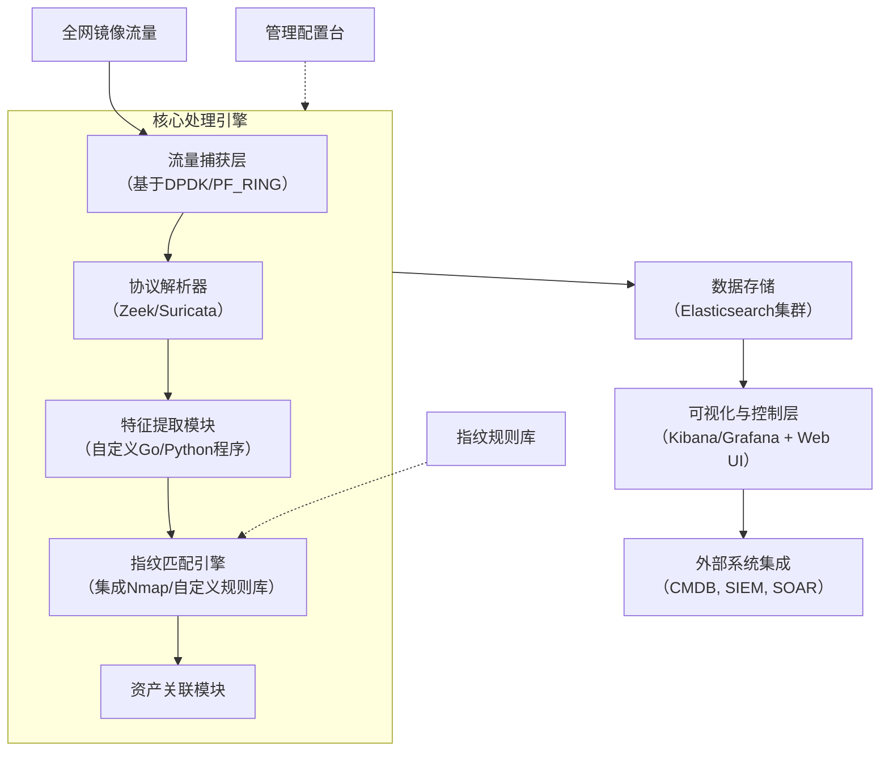

---

# **被动式网络资产识别与分析系统需求文档**

**文档版本:** V1.0
**最后更新日期:** 2025-8-20
**项目负责人:** [您的姓名/团队]
**状态:** 草案

---

## 1. 项目概述与背景

### 1.1. 项目背景
随着企业网络规模的扩大和业务的多样化，网络中的资产（如服务器、工作站、网络设备、物联网设备、虚拟机等）数量激增，类型日趋复杂。传统的主动扫描式资产发现方法存在扫描周期长、可能干扰业务、无法发现临时在线设备等局限性，且无法满足对资产动态变化进行持续监控的需求。

为解决上述问题，本项目旨在开发一套**被动式网络资产识别与分析系统**。该系统通过旁路监听网络核心交换机镜像出的全网流量，在不干扰任何业务的前提下，实现对网络内所有资产的自动发现、深度识别、持续监控和集中化管理。

### 1.2. 项目目标
构建一个高性能、高准确性的被动资产识别系统，实现以下核心目标：
1.  **全量资产发现:** 自动识别网络内所有在线资产，无需预知IP地址段。
2.  **深度资产画像:** 不仅识别IP和MAC，更能精准识别资产类型、操作系统、设备厂商、服务应用等关键信息。
3.  **动态持续监控:** 7x24小时不间断监控，实时感知资产的上线、下线、配置变更等动态行为。
4.  **统一视图管理:** 提供集中的资产清单和可视化仪表盘，为安全运营、网络运维和资产管理提供数据支撑。

## 2. 核心功能需求

### 2.1. 流量捕获与预处理
- **FR-010:** 系统必须能够稳定接入交换机镜像端口输出的千兆/万兆级全流量数据。
- **FR-011:** 系统需具备高性能抓包能力，采用零拷贝或内核旁路等技术（如PF_RING/DPDK），确保在流量高峰时**丢包率低于1%**。
- **FR-012:** 系统需能对原始流量进行初步过滤，可配置只处理与资产识别相关的关键协议（如ARP, DHCP, HTTP, DNS, TLS, SSH等），以提升处理效率。

### 2.2. 协议解析与特征提取
系统需深度解析以下协议，并提取关键字段作为资产指纹：
- **FR-020: ARP:** 提取IP与MAC地址对应关系。
- **FR-021: DHCP:** 提取主机名、MAC地址、请求参数、客户端标识符等，用于识别操作系统类型。
- **FR-022: HTTP/S:**
    - HTTP: 提取 `Host`, `User-Agent`, `Server`, `X-Powered-By` 等头字段。
    - HTTPS: 提取SSL/TLS证书中的**通用名(CN)、组织名称(O)**等信息，以及**JA3/JA3S/JA4**指纹。
- **FR-023: DNS:** 提取正反向DNS查询记录，关联IP与主机名。
- **FR-024: SMB/NBNS/SSDP:** 提取计算机名、操作系统版本等Windows环境特有信息。
- **FR-025: mDNS/LLDP/CDP:** 提取主机名、设备型号、厂商等局域网服务发现协议信息。

### 2.3. 资产指纹识别
系统需集成多种指纹库和识别技术，对提取的特征进行匹配：
- **FR-030: MAC地址识别:** 根据IEEE OUI库识别网卡厂商。
- **FR-031: 操作系统识别:** 基于TCP/IP堆栈指纹（TTL、窗口大小等）、DHCP指纹、HTTP User-Agent等综合判断操作系统类型（Windows, Linux, macOS, Unix等）及大致版本。
- **FR-032: 设备类型识别:** 根据协议行为、端口、横幅等信息精准区分：
    - 通用服务器、台式机、笔记本电脑
    - **VMware虚拟机** (通过MAC OUI `00:50:56`、端口902横幅、mDNS服务等)
    - 网络设备（路由器、交换机、防火墙）
    - 打印机、摄像头、IoT设备等
- **FR-033: 服务与应用识别:** 识别资产上开放的端口及运行的服务（如Apache, Nginx, MySQL, Redis等），包括版本信息。

### 2.4. 数据关联与聚合
- **FR-040:** 系统需将来自不同协议和时间的碎片信息（如IP、MAC、主机名、操作系统）进行智能关联，聚合成唯一的资产画像。
- **FR-041:** 系统应记录资产的首次发现时间、最后活跃时间，并计算其活跃度。
- **FR-042:** 系统应能识别资产的变化（如IP变更、新服务开放）并生成变更日志。

### 2.5. 数据存储与输出
- **FR-050:** 所有识别到的资产信息及原始日志需持久化存储到数据库中，推荐使用**Elasticsearch**以支持高效全文检索与聚合分析。
- **FR-051:** 系统需提供API接口（如RESTful API），供其他系统（CMDB, SIEM, SOAR）查询和订阅资产数据。
- **FR-052:** 系统应支持将资产数据以JSON格式导出。

### 2.6. 可视化与告警
- **FR-060:** 系统需提供Web管理界面，集成**Kibana**或**Grafana**作为可视化组件。
- **FR-061:** 仪表盘需展示全局资产统计、类型分布、操作系统分布、新发现资产列表、活跃资产拓扑等。
- **FR-062:** 系统应支持配置告警规则，如发现**未知资产**、**特定类型设备**（如摄像头）或**资产异常下线**时，通过邮件、API等方式通知管理员。

## 3. 非功能性需求

### 3.1. 性能需求
- **NFR-001:** 系统应能线性扩展，以处理不低于1 Gbps的满负载镜像流量。
- **NFR-002:** 从流量捕获到资产信息入库的端到端延迟应低于5分钟。
- **NFR-003:** 数据存储应能保留至少90天的详细资产历史记录。

### 3.2. 安全与合规需求
- **NFR-010:** 系统设计必须遵循**隐私保护原则**。**严禁**存储或记录应用层敏感数据（如HTTP POST内容、邮件正文、密码等）。
- **NFR-011:** 系统应支持对MAC地址、IP地址等个人标识信息进行散列化处理（如SHA256），实现匿名化分析。
- **NFR-012:** 系统的部署和使用必须获得公司管理层的书面授权，并在登录界面明确提示“网络行为正在被监控”。

### 3.3. 可用性与可维护性
- **NFR-020:** 系统核心服务应具备高可用性，支持故障自动恢复。
- **NFR-021:** 系统应提供完善的日志记录，便于故障排查和性能监控。
- **NFR-022:** 指纹库应支持在线更新和手动导入，规则应易于维护和扩展。

## 4. 系统架构与技术选型建议

### 4.1. 高层架构图
系统建议采用模块化设计，如下图所示：

### 4.2. 技术选型推荐
| 组件 | 推荐技术 | 备注 |
| :--- | :--- | :--- |
| **流量捕获** | `PF_RING` (首选) / `DPDK` | 平衡性能与开发复杂度，确保低丢包。 |
| **协议解析** | **dpi** | 产出结构化日志，极大减少开发量，社区活跃。 |
| **核心逻辑** | `Python 3` / `Go` | Python擅长快速开发数据处理脚本；Go擅长高性能并发处理。 |
| **指纹库** | `Nmap`指纹库, `FingerprintHub`, **自定义规则** | 基础，必须集成并持续维护。 |
| **数据存储** | **Elasticsearch** | 强大的搜索和聚合能力，与Kibana无缝集成。 |
| **可视化** | **Kibana** / Grafana | 快速构建资产仪表盘和告警。 |

## 5. 部署与实施考量

1.  **网络部署点:** 系统服务器应部署在核心交换机镜像端口可达的网络区域。
2.  **服务器规格:** 建议使用高性能物理服务器，配备多核CPU、万兆光口网卡（支持PF_RING/DPDK）、SSD硬盘和大容量内存。
3.  **分阶段实施:** 建议先进行POC验证，处理小范围流量，验证识别准确性，再逐步推广至全网。

## 6. 成功指标 (KPI)

-   资产发现准确率 > 95%
-   未知资产发现后告警延迟 < 3分钟
-   系统月度正常运行时间 > 99.9%
-   资产库存数据与CMDB/人工盘点的吻合度提升50%以上

---
**版本记录:**
| 版本号 | 日期 | 作者 | 修订说明 |
| :--- | :--- | :--- | :--- |
| V1.0 | 2023-10-27 | AI Assistant | 初始版本创建 |